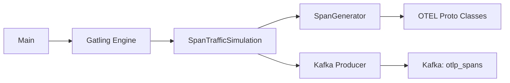
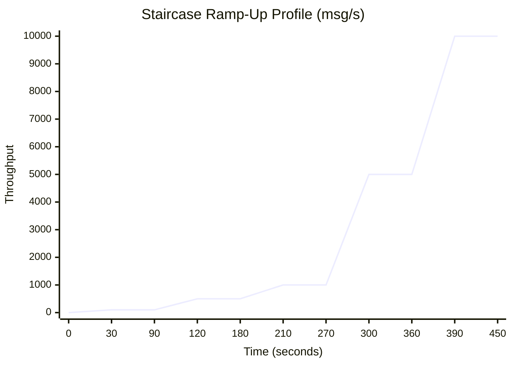

# Architecture

## High-Level Design

The `gatling-load-gen` project is a **synthetic load generator** that produces realistic OpenTelemetry (OTEL) span traffic and publishes it to Apache Kafka. It simulates traces from a LOTR-themed chatbot agent (`lotrbot`) for use in load-testing the Linoleum runtime verification pipeline.

## Architectural Pattern

The project follows a **pipeline / batch processing** pattern:

1. **Entry point** (`Main`) programmatically launches Gatling with a specific simulation class.
2. **Simulation** (`SpanTrafficSimulation`) defines the injection profile (staircase ramp-up) and the per-user scenario.
3. **Generator** (`SpanGenerator`) creates one realistic `ExportTraceServiceRequest` protobuf message per invocation, containing a trace with 4 spans.
4. **Kafka protocol** (from `gatling-kafka-plugin`) serializes each message as raw protobuf bytes and publishes to the `otlp_spans` topic.

## Key Design Decisions

- **Programmatic Gatling launch** instead of using the Gatling standalone runner or Maven/Gradle plugin — this allows overriding Kafka bootstrap servers via JVM system properties.
- **Protobuf serialization** — traces are serialized as raw protobuf bytes (`ByteArraySerializer`) to match the OTEL Collector wire format. String keys are UUIDs.
- **Fire-and-forget Kafka producers** (`acks=0`) — prioritizes throughput over delivery guarantees, appropriate for load generation.
- **Staircase injection profile** — progressively ramps from 100 to 10,000 messages/second with 30s ramps and 60s plateaus (450s total), enabling observation of system behavior under increasing load.

## Visual: Injection Profile

