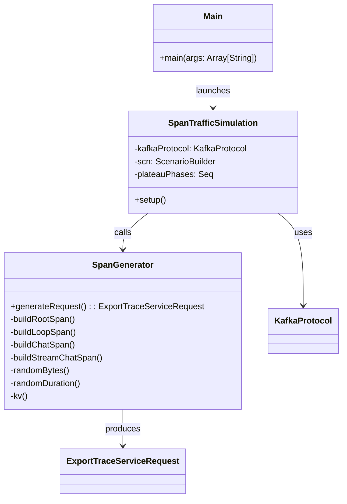

# Components

## Component Map



## Component Details

### 1. `Main` — Entry Point

**File:** `src/main/scala/io/github/demiourgoi/linoleum/loadgen/Main.scala`

Responsible for:
- Reading `kafka.bootstrap.servers` from JVM system properties (default: `localhost:9092`)
- Printing startup info (bootstrap servers, topic, Java version)
- Building Gatling properties with the simulation class and results directory
- Launching the Gatling engine programmatically via `Gatling.fromMap()`

### 2. `SpanTrafficSimulation` — Gatling Simulation

**File:** `src/main/scala/io/github/demiourgoi/linoleum/loadgen/SpanTrafficSimulation.scala`

Extends `io.gatling.core.scenario.Simulation`. Responsible for:

- **Kafka Protocol Configuration:** Defines the Kafka producer settings (`BOOTSTRAP_SERVERS`, serializer classes, `acks=0`, `linger.ms=5`, `batch.size=16384`) targeting the `otlp_spans` topic.
- **Scenario Definition:** A Gatling scenario where each virtual user:
  1. Captures the simulation start time and logs plateau transitions
  2. Generates one `ExportTraceServiceRequest` via `SpanGenerator.generateRequest()`
  3. Serializes it to bytes and sets it as the Kafka value with a random UUID key
  4. Sends it to Kafka via `kafka("Send spans").send()`
- **Injection Profile:** Staircase ramp-up:
  - 30s ramp 0→100, 60s hold
  - 30s ramp 100→500, 60s hold
  - 30s ramp 500→1000, 60s hold
  - 30s ramp 1000→5000, 60s hold
  - 30s ramp 5000→10000, 60s hold
- **Plateau Logging:** Prints `[INFO]` messages when each new plateau phase begins.

### 3. `SpanGenerator` — OTEL Span Protobuf Generator

**File:** `src/main/scala/io/github/demiourgoi/linoleum/loadgen/SpanGenerator.scala`

A Scala `object` (singleton) that generates realistic `ExportTraceServiceRequest` protobuf messages. Each request contains **one trace with 4 spans** arranged as a tree:

```
root: invoke_agent (parentSpanId empty)
  ├── execute_event_loop_cycle
  │     ├── chat (with gen_ai events)
  │     └── stream_chat
```

**Span attributes mirror the `lotrbot` agent traces**, including:
- `service.name`, `telemetry.sdk.*` on the Resource
- `gen_ai.*` semantic convention attributes
- LOTR-specific attributes (`lotrbot.chat_id`, `system_prompt`)
- HTTP attributes on `stream_chat` (targeting `api.mistral.ai`)
- `gen_ai.user.message` and `gen_ai.choice` span events

**Helper utilities:**
- `randomBytes(n)` — generates random ByteStrings for trace/span IDs using `SecureRandom`
- `randomDuration(min, max)` — generates random nanosecond durations
- `kv(key, value)` — builds OTEL `KeyValue` protobuf messages
- `chatIdCounter` — atomic counter for unique chat IDs
- `fakeNowNanos` — atomic counter for monotonically increasing timestamps (+10s per request)
