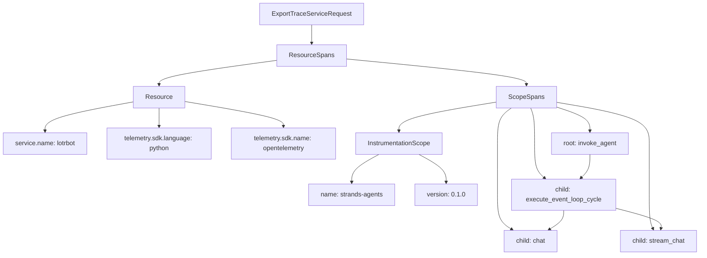
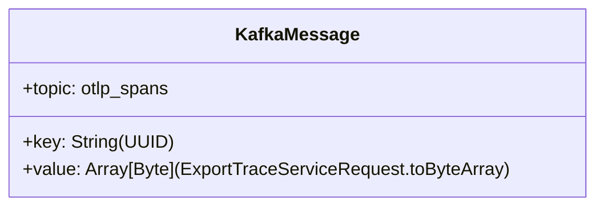

# Data Models

## Primary Data Model: ExportTraceServiceRequest

Each generated message is an OTEL `ExportTraceServiceRequest` protobuf. The structure per message is:

## Span Structure

### 1. Root Span: `invoke_agent`

| Field | Value |
|---|---|
| `parentSpanId` | Empty (root) |
| `kind` | `SPAN_KIND_INTERNAL` |
| Duration | 1–3 seconds (random) |
| `gen_ai.operation.name` | `invoke_agent` |
| `gen_ai.system` | `strands-agents` |
| `gen_ai.agent.name` | `<chatId>` |
| `gen_ai.request.model` | `mistral-small-latest` |
| `gen_ai.agent.tools` | `["generate_image", "say_something_nice"]` |
| `system_prompt` | LOTR expert prompt |
| **Events** | `gen_ai.user.message` (Balrog question), `gen_ai.choice` (Balrog response) |

### 2. Child Span: `execute_event_loop_cycle`

| Field | Value |
|---|---|
| `parentSpanId` | Root span ID |
| `kind` | `SPAN_KIND_INTERNAL` |
| Duration | 2–5 seconds |
| `lotrbot.chat_id` | Same chat ID |
| `event_loop.cycle_id` | Random UUID |

### 3. Child Span: `chat`

| Field | Value |
|---|---|
| `parentSpanId` | Loop span ID |
| `kind` | `SPAN_KIND_INTERNAL` |
| Duration | 0.5–2 seconds |
| `gen_ai.operation.name` | `chat` |
| `gen_ai.system` | `strands-agents` |
| `gen_ai.request.model` | `mistral-small-latest` |
| **Events** | `gen_ai.user.message`, `gen_ai.choice` (Balrog responses) |

### 4. Child Span: `stream_chat`

| Field | Value |
|---|---|
| `parentSpanId` | Loop span ID |
| `kind` | `SPAN_KIND_CLIENT` |
| Duration | 0.5–2 seconds |
| `http.request.method` | `POST` |
| `http.url` | `https://api.mistral.ai/v1/chat/completions#stream` |
| `server.address` | `api.mistral.ai` |
| `server.port` | `443` |
| `gen_ai.request.model` | `mistral-small-latest` |
| `agent.trace.public` | Empty string |

## IDs and Timestamps

- **Trace IDs:** 16 random bytes
- **Span IDs:** 8 random bytes each
- **Chat IDs:** `lotrbot/<UUID>/<counter>` — counter increments per request
- **Timestamps:** Monotonically increasing in 10-second increments per request, with random intra-span offsets

## Kafka Message Format

