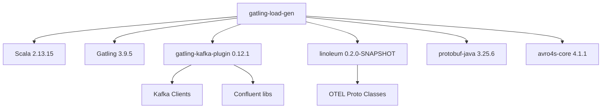

# Dependencies

## Dependency Map

## Direct Dependencies

| Group | Artifact | Version | Scope | Purpose |
|---|---|---|---|---|
| `org.scala-lang` | `scala-library` | 2.13.15 | implementation | Scala runtime |
| `io.gatling` | `gatling-core` | 3.9.5 | implementation | Load testing engine |
| `io.gatling.highcharts` | `gatling-charts-highcharts` | 3.9.5 | implementation | Gatling reports |
| `io.gatling` | `gatling-app` | 3.9.5 | implementation | Gatling application runner |
| `ru.tinkoff` | `gatling-kafka-plugin_2.13` | 0.12.1 | implementation | Kafka protocol for Gatling |
| `io.github.demiourgoi` | `linoleum_2.13` | 0.2.0-SNAPSHOT | implementation | OTEL protobuf classes |
| `com.google.protobuf` | `protobuf-java` | 3.25.6 | implementation | Protobuf serialization API |
| `com.sksamuel.avro4s` | `avro4s-core_2.13` | 4.1.1 | implementation | Avro support (required by gatling-kafka-plugin) |

## Excluded Transitive Dependencies (from linoleum)

The `linoleum` library pulls in many transitive dependencies not needed for load generation. These are explicitly excluded:

- `org.apache.flink` — Flink streaming (not needed)
- `com.twitter` — Twitter/chill serialization (not needed)
- `org.apache.logging.log4j` — logging (not needed)
- `org.slf4j` — logging facade (not needed)
- `com.github.pureconfig` — config library (not needed)
- `org.mongodb` — MongoDB driver (not needed)
- `es.ucm.maude` — Maude integration (not needed)
- `io.github.demiourgoi:sscheck-core_2.13` — property testing (not needed)
- `com.google.guava` — Guava utilities (not needed)
- `org.apache.commons` — Apache commons (not needed)
- `com.google.code.gson` — JSON serialization (not needed)

Protobuf is intentionally **not** excluded, as it provides `ByteString`, `toByteArray`, and the OTEL proto classes.

## Repository Configuration

| Repository | URL | Purpose |
|---|---|---|
| Maven Local | `~/.m2` | linoleum SNAPSHOT |
| Maven Central | `https://repo1.maven.org/maven2/` | Standard dependencies |
| Confluent | `https://packages.confluent.io/maven/` | gatling-kafka-plugin transitive deps |

## Build Tool Configuration

| Setting | Value |
|---|---|
| Gradle version | 8.10.2 |
| Java toolchain | 17 |
| Source encoding | UTF-8 |
| Gradle plugin: `scala` | For Scala compilation |
| Gradle plugin: `application` | For `mainClass` and `gradle run` |
| Gradle plugin: `foojay-resolver` | Automatic JDK download (settings.gradle.kts) |
