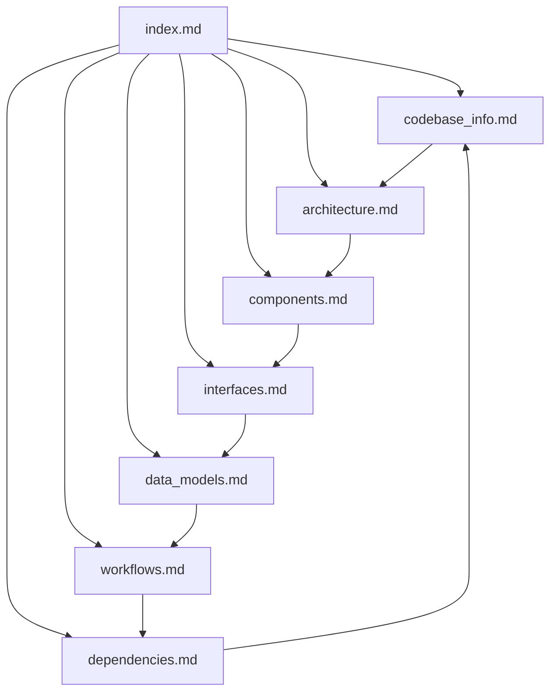

# Knowledge Base Index

> **For AI assistants:** This file is your primary entry point for understanding the `gatling-load-gen` project. Read this first — it contains metadata about every documentation file so you can quickly find what you need without loading all files into context.

## Table of Contents

| File | Description | When to consult |
|---|---|---|
| [codebase_info.md](codebase_info.md) | Project overview, tech stack, directory structure, setup instructions | Getting started, understanding the technology choices |
| [architecture.md](architecture.md) | High-level design, architectural patterns, design decisions | Understanding how components fit together, the overall system design |
| [components.md](components.md) | Detailed descriptions of the 3 source components (Main, SpanGenerator, SpanTrafficSimulation) | Understanding what each class does, its responsibilities, and internal structure |
| [interfaces.md](interfaces.md) | Kafka topic schema, external library APIs consumed, configuration interface | Understanding data flowing in/out, integration points |
| [data_models.md](data_models.md) | Protobuf message structure, span tree, attribute details, IDs and timestamps | Understanding the shape of generated data, span relationships |
| [workflows.md](workflows.md) | End-to-end load generation flow, span generation steps, injection timeline | Understanding execution flow, staircase ramp-up schedule |
| [dependencies.md](dependencies.md) | Direct/transitive dependencies, excluded deps, repository configuration | Understanding library dependencies, why certain exclusions exist |
| [review_notes.md](review_notes.md) | Consistency and completeness review findings | Identifying documentation gaps or areas needing improvement |

## Quick Reference: Key Facts

- **Purpose:** Synthetic OTEL span load generator for Kafka, built on Gatling + gatling-kafka-plugin.
- **Language:** Scala 2.13, Java 17 toolchain.
- **Output:** Protobuf-serialized `ExportTraceServiceRequest` messages to Kafka topic `otlp_spans`.
- **Injection profile:** Staircase ramp-up 100→10,000 msg/s over 450s (30s ramps, 60s plateaus).
- **Internal dep:** `linoleum_2.13:0.2.0-SNAPSHOT` (published locally via `make release`).

## Document Relationships

## Recommended Reading Paths

**For a first-time understanding:** `codebase_info.md` → `architecture.md` → `components.md` → `workflows.md`

**For understanding data format:** `data_models.md` → `interfaces.md` → `dependencies.md`

**For modifying the load pattern:** `workflows.md` → `components.md` (SpanTrafficSimulation section) → `architecture.md`

**For changing the span content:** `data_models.md` → `components.md` (SpanGenerator section)
