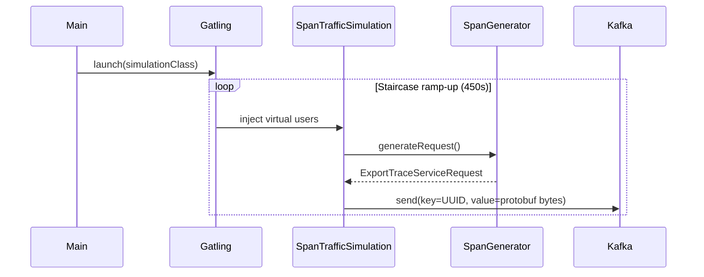

# Interfaces & Integration Points

## External Interfaces (Produced by this project)

### Kafka Topic: `otlp_spans`

This project **produces** messages to the Kafka topic `otlp_spans`.

| Property | Value |
|---|---|
| Topic | `otlp_spans` |
| Key type | `String` (UUID) |
| Value type | `ByteArray` (protobuf-serialized `ExportTraceServiceRequest`) |
| Serialization | Raw protobuf bytes (no envelope/registry) |
| Producer ACKS | `0` (fire-and-forget) |
| Linger | 5 ms |
| Batch size | 16384 bytes |

**Message schema:** Each message is an OTEL `ExportTraceServiceRequest` protobuf containing one trace with 4 spans. See [data_models.md](data_models.md) for the detailed structure.

## External Interfaces (Consumed by this project)

### `io.github.demiourgoi:linoleum_2.13:0.2.0-SNAPSHOT`

Internal library published to local Maven (`~/.m2`) via `make release` in the `linoleum` project. Provides:

- OTEL protobuf Java classes: `ExportTraceServiceRequest`, `ResourceSpans`, `ScopeSpans`, `Span`, `Span.Event`, `Resource`, `InstrumentationScope`, `KeyValue`, `AnyValue`
- Many transitive dependencies (Flink, MongoDB, Twitter, etc.) are **excluded** — only the protobuf classes are needed.

### Gatling Framework

- `io.gatling.app.Gatling` — programmatic Gatling launcher
- `io.gatling.core.Predef._` — DSL imports (`scenario`, `Simulation`, injection steps)
- `io.gatling.core.config.GatlingPropertiesBuilder` — configuration builder

### gatling-kafka-plugin

- `ru.tinkoff.gatling.kafka.Predef._` — Kafka DSL (`kafka.topic(...)`, `.send()`)
- `ru.tinkoff.gatling.kafka.protocol.KafkaProtocol` — protocol configuration

## Configuration Interface

| Parameter | Source | Default |
|---|---|---|
| `kafka.bootstrap.servers` | JVM system property (`-D`) | `localhost:9092` |

## Runtime Dependencies (Transitive)

Required but not directly referenced in source code:
- Apache Kafka clients (from gatling-kafka-plugin)
- Confluent libraries (from gatling-kafka-plugin transitive deps, served via `https://packages.confluent.io/maven/`)

## Mermaid: Data Flow

