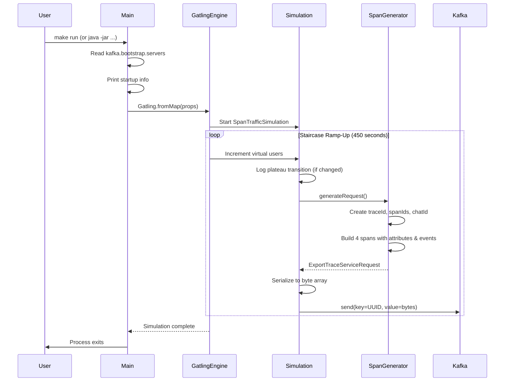
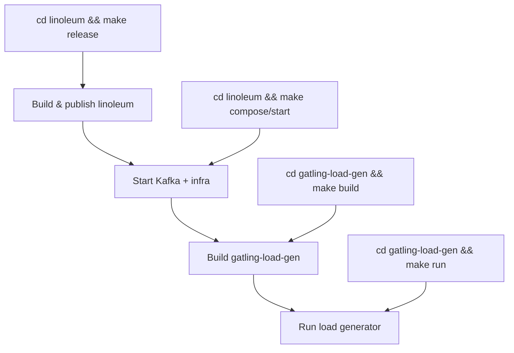

# Workflows

## Primary Workflow: Load Generation

## Detailed Step: Span Generation

1. Generate random 16-byte `traceId` and four 8-byte `spanId`s.
2. Compute `baseTime` from an atomic counter (+10s per request).
3. Create a unique `chatId` as `lotrbot/<UUID>/<counter>`.
4. Build the protobuf message:
   a. **Resource** with `service.name=lotrbot`, SDK attributes.
   b. **InstrumentationScope** with `strands-agents` v0.1.0.
   c. Four spans with parent-child relationships, attributes, and random durations.
5. Return the complete `ExportTraceServiceRequest`.

## Detailed Step: Kafka Publishing (per virtual user)

1. On first user execution, capture `simulationStartMs`.
2. Check elapsed time and log plateau phase transitions.
3. Call `SpanGenerator.generateRequest()`.
4. Create a random UUID as the Kafka key.
5. Serialize the request via `.toByteArray` (protobuf).
6. Publish to Kafka topic `otlp_spans`.

## Injection Profile Timeline

```mermaid
gantt
    title Staircase Ramp-Up (450 seconds)
    dateFormat X
    axisFormat %s s
    section Throughput
    Ramp 0→100    :0, 30s
    Hold 100      :30, 60s
    Ramp 100→500  :90, 30s
    Hold 500      :120, 60s
    Ramp 500→1000 :180, 30s
    Hold 1000     :210, 60s
    Ramp 1000→5000:270, 30s
    Hold 5000     :300, 60s
    Ramp 5000→10000:360, 30s
    Hold 10000    :390, 60s
```

## Setup Workflow (Prerequisites)

