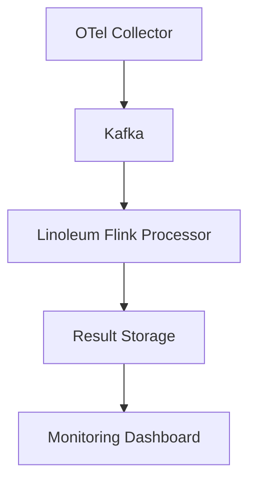

# Architectural Patterns

## Span Processing Pipeline
1. **Span Consumption**: 
   - Kafka consumer groups for parallel ingestion
   - OTLP deserialization

2. **Trace Assembly**:
   - Session windows for trace completeness
   - Parent-child span relationship resolution
   - Timestamp-based ordering

3. **Event Linearization**:
   - SpanStart/SpanEnd event generation
   - Time window discretization
   - Event sequence formation

4. **Formula Evaluation**:
   - LTLss next form transformation
   - Next form evaluation
   - Timeout handling implicit in next form

## Key Design Decisions
- **State Management**: Flink's window keyed by trace id for trace assembly
- **Fault Tolerance**: Flink mechanisms using checkpointing and replay based on Kafka offsets
- **Scalability**: Partitioned processing by trace ID
- **Testing**: Maude model-based test generation
