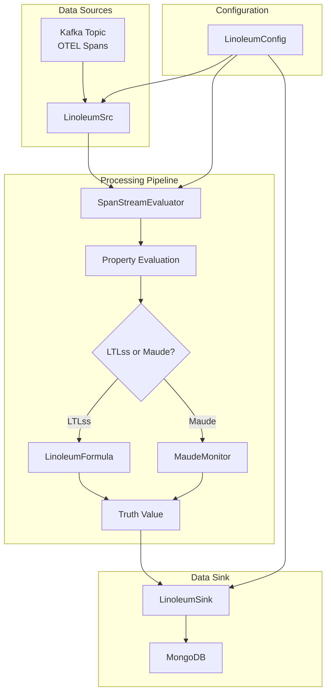
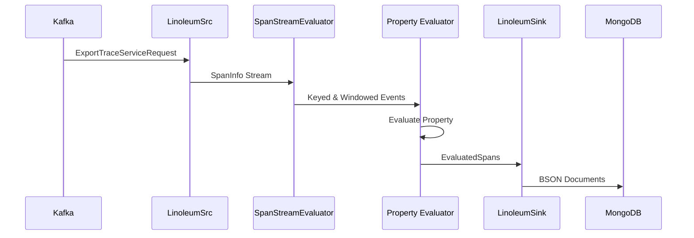
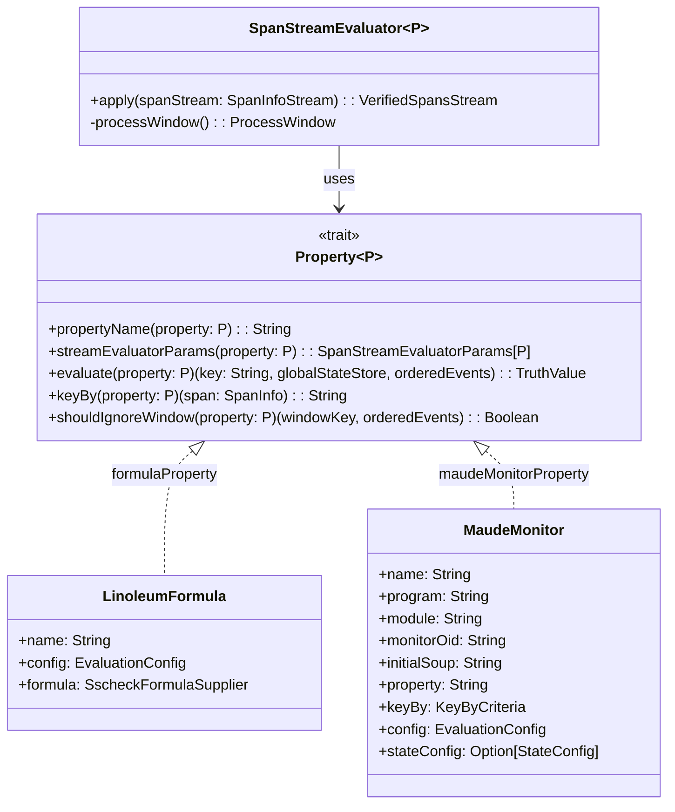

# Linoleum Architecture

## System Overview

Linoleum is a runtime verification system for distributed systems that processes OpenTelemetry (OTEL) spans using Apache Flink. It evaluates temporal properties expressed as either LTLss formulas or Maude programs on trace data.

## High-Level Architecture

## Component Architecture

### Data Flow Architecture

### Property Evaluation Architecture

## Design Patterns

### 1. Type Class Pattern
The `Property[P]` trait serves as a type class enabling extensible property evaluation:
- **Separation of concerns**: Evaluation logic separated from data structures
- **Extensibility**: New property types can be added without modifying core logic
- **Polymorphism**: Runtime selection of evaluation strategy

### 2. Session Window Processing
- **Event-time processing**: Uses span timestamps for ordering
- **Session windows**: Groups spans by trace ID with configurable gaps
- **State management**: Keyed state for MaudeMonitor across windows
- **Watermarks**: Handles out-of-order and late events

### 3. Plugin Architecture
- **Source plugins**: `LinoleumSrc` for Kafka (extensible to other sources)
- **Sink plugins**: `LinoleumSink` for MongoDB (extensible to other sinks)
- **Property plugins**: `Property` type class for new evaluation strategies

### 4. Formal Methods Integration
- **LTLss**: Linear Temporal Logic for Streams and Systems
- **Maude**: Rewriting logic for stateful monitoring
- **Hybrid approach**: Choose between stateless (LTLss) and stateful (Maude) evaluation

## Key Architectural Decisions

### 1. Flink-Based Stream Processing
**Decision**: Use Apache Flink for distributed stream processing
**Rationale**:
- Built-in support for event-time processing
- Session windows with configurable gaps
- State management with TTL support
- Exactly-once processing guarantees
- Rich ecosystem of connectors

### 2. Dual Property Evaluation Strategy
**Decision**: Support both LTLss formulas and Maude programs
**Rationale**:
- **LTLss**: Lightweight, stateless evaluation suitable for simple temporal properties
- **Maude**: Powerful, stateful evaluation for complex monitoring scenarios
- **Flexibility**: Users choose based on property complexity and state requirements

### 3. OpenTelemetry Compatibility
**Decision**: Use OTEL span format as input
**Rationale**:
- Industry standard for distributed tracing
- Rich metadata (attributes, events, resources)
- Protocol buffers for efficient serialization
- Wide ecosystem support

### 4. MongoDB as Result Store
**Decision**: Store evaluation results in MongoDB
**Rationale**:
- Flexible schema for evaluation results
- Time-series data support
- Rich query capabilities
- Horizontal scalability

### 5. Type-Safe Configuration
**Decision**: Use case classes for hierarchical configuration
**Rationale**:
- Compile-time type safety
- Default values for common scenarios
- Easy extensibility for new features
- Clear separation of concerns

## Data Flow Details

### Span Ingestion
1. **Kafka Source**: Reads `ExportTraceServiceRequest` protobuf messages
2. **Deserialization**: Converts protobuf to `SpanInfo` objects
3. **Timestamp Extraction**: Uses span start time for event-time processing
4. **Watermark Generation**: Configurable out-of-orderness handling

### Event Processing
1. **Span Conversion**: Each span generates `SpanStart` and `SpanEnd` events
2. **Key Partitioning**: Events grouped by trace ID (or custom key)
3. **Session Windowing**: Windows close after configurable inactivity gap
4. **Event Ordering**: Events sorted by epoch (start/end time)

### Property Evaluation
1. **Window Processing**: Each window processed independently
2. **Property Selection**: Based on configured property type
3. **State Management**: For MaudeMonitor, state persists across windows
4. **Result Generation**: `EvaluatedSpans` with truth value

### Result Persistence
1. **BSON Conversion**: `EvaluatedSpans` converted to BSON documents
2. **Batch Writing**: Configurable batch size and interval
3. **Delivery Guarantee**: At-least-once semantics
4. **Time-Series Data**: Structured for time-series queries

## Performance Considerations

### Window Processing Optimization
- **Session gaps**: Configurable based on expected trace characteristics
- **Allowed lateness**: Balances completeness vs. latency
- **State TTL**: Prevents unbounded state growth for MaudeMonitor

### Maude Performance
- **Rewrite bounds**: Limits per-message computation
- **State serialization**: Efficient string representation
- **Thread safety**: Synchronized access to Maude runtime

### Serialization Efficiency
- **Kryo with protobuf**: Optimized serialization for Flink
- **BSON conversion**: Efficient MongoDB storage
- **Binary formats**: Minimize network overhead

## Scalability Considerations

### Horizontal Scaling
- **Flink parallelism**: Configurable operator parallelism
- **Kafka partitioning**: Aligns with Flink parallelism
- **MongoDB sharding**: For high-volume result storage

### State Management
- **RocksDB state backend**: For large state volumes
- **Checkpointing**: Fault tolerance with configurable intervals
- **State TTL**: Automatic cleanup of stale state

### Resource Isolation
- **Task slots**: Isolate property evaluation tasks
- **Memory management**: Configurable heap and off-heap memory
- **Network buffers**: Optimized for high-throughput scenarios

## Extension Points

### Custom Property Types
Implement `Property[P]` trait with:
- Evaluation logic
- Configuration parameters
- State management (if needed)
- Serialization support

### Alternative Sources/Sinks
Extend or replace:
- `LinoleumSrc` for different data sources
- `LinoleumSink` for different storage backends
- Custom serializers for different formats

### Monitoring and Observability
- Flink metrics integration
- Custom metrics for property evaluation
- Logging at different verbosity levels
- Tracing for debugging complex evaluations