# Linoleum Workflows

## Overview

Linoleum processes OpenTelemetry spans through a series of well-defined workflows to evaluate temporal properties. The system supports two types of property evaluation: LTLss formulas (stateless) and Maude programs (stateful).

## End-to-End Processing Workflow

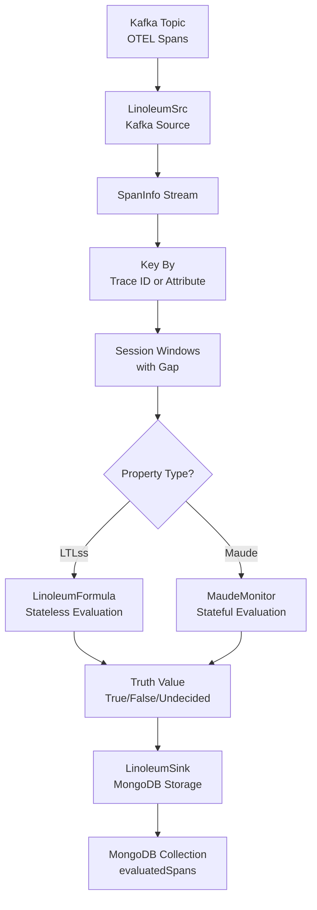

## Span Ingestion Workflow

### 1. Kafka Source Processing
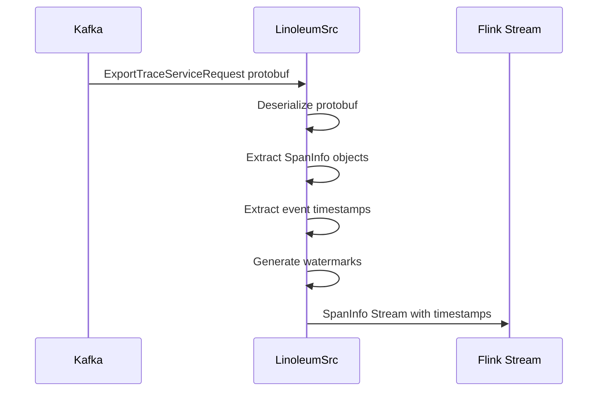

**Steps**:
1. **Deserialization**: Convert protobuf `ExportTraceServiceRequest` to `SpanInfo` objects
2. **Timestamp Extraction**: Use span start time as event time
3. **Watermark Generation**: Configurable out-of-orderness tolerance
4. **Stream Creation**: Produce `SpanInfoStream` for downstream processing

**Key Configuration**:
- `kafkaBootstrapServers`: Kafka broker addresses
- `kafkaTopics`: Source topics (default: `otlp_spans`)
- `eventsMaxOutOfOrderness`: Watermark generation parameter

## Event Processing Workflow

### 2. Span to Event Conversion
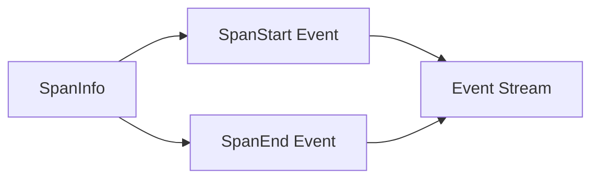

**Conversion Logic**:
- Each `SpanInfo` generates two `LinoleumEvent`s:
  - `SpanStart`: Timestamp = span start time
  - `SpanEnd`: Timestamp = span end time
- Events are ordered by their `epochUnixNano` timestamp
- Duplicate spans (same span ID) are filtered out

### 3. Key Partitioning and Windowing
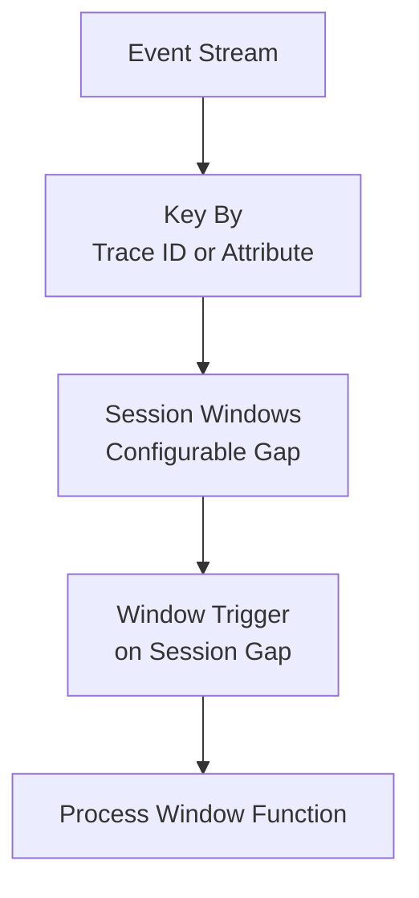

**Key Partitioning**:
- Default: Group by trace ID (`KeyByTraceId`)
- Alternative: Group by span attribute value (`KeyByStringSpanAttribute`)
- Custom: Implement `KeyByCriteria` trait for custom grouping

**Session Windows**:
- Windows close after configurable inactivity gap
- Configurable allowed lateness for late events
- Each window contains events for a single trace (or custom key)

## Property Evaluation Workflows

### 4. LTLss Formula Evaluation
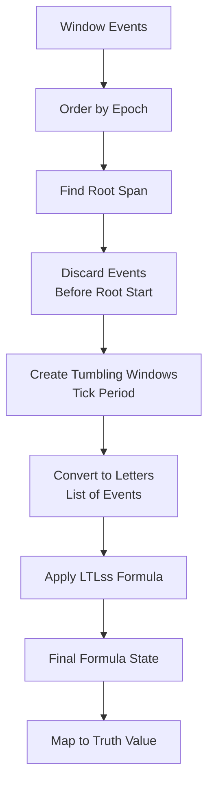

**LTLss-Specific Logic**:
- Only processes first window containing root span
- Events before root span start are discarded
- Time discretized into tumbling windows of `tickPeriod` duration
- Formula evaluated over sequence of letters (event lists)

**Evaluation Process**:
1. **Letter Construction**: Group events into time-based letters
2. **Formula Application**: Apply LTLss formula to letter sequence
3. **State Tracking**: Maintain formula state across letters
4. **Result Mapping**: Convert final formula state to `TruthValue`

### 5. Maude Monitor Evaluation
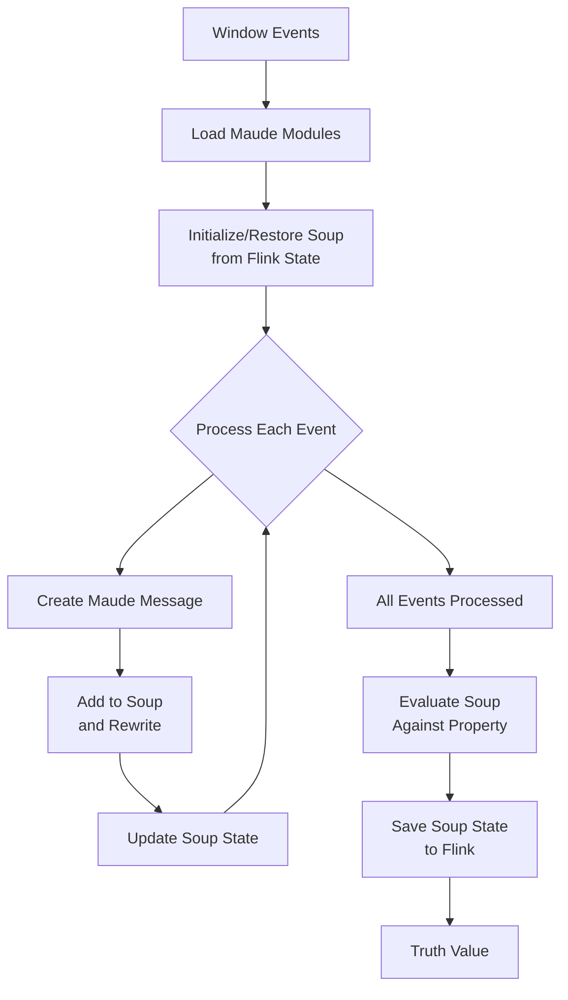

**Maude-Specific Logic**:
- State persists across windows via Flink keyed state
- Configurable TTL for state cleanup
- Custom window filtering for TTL edge cases
- Supports equality and rewriting hooks

**Evaluation Process**:
1. **Module Loading**: Load Maude program and dependencies
2. **State Management**: Initialize or restore soup from Flink state
3. **Event Processing**: Convert each event to Maude message, add to soup, rewrite
4. **Property Evaluation**: Evaluate final soup against property using `|=` operator
5. **State Persistence**: Save updated soup to Flink state

## Result Storage Workflow

### 6. MongoDB Sink Processing
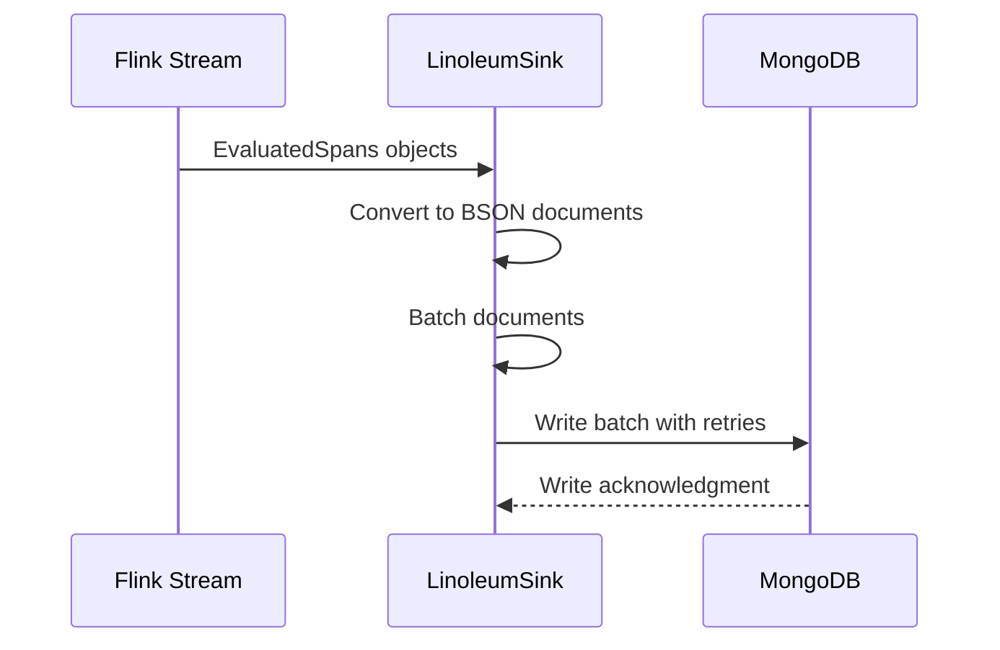

**Storage Process**:
1. **Conversion**: `EvaluatedSpans` → BSON documents
2. **Batching**: Configurable batch size and interval
3. **Writing**: At-least-once delivery to MongoDB
4. **Retry Logic**: Configurable retry attempts

**Document Structure**:
```json
{
  "key": "trace-id-or-custom-key",
  "startDate": ISODate("2024-01-01T00:00:00Z"),
  "evaluationDate": ISODate("2024-01-01T00:00:05.123Z"),
  "propertyName": "PropertyName",
  "truthValue": "True|False|Undecided"
}
```

## Configuration and Execution Workflow

### 7. Job Setup and Execution
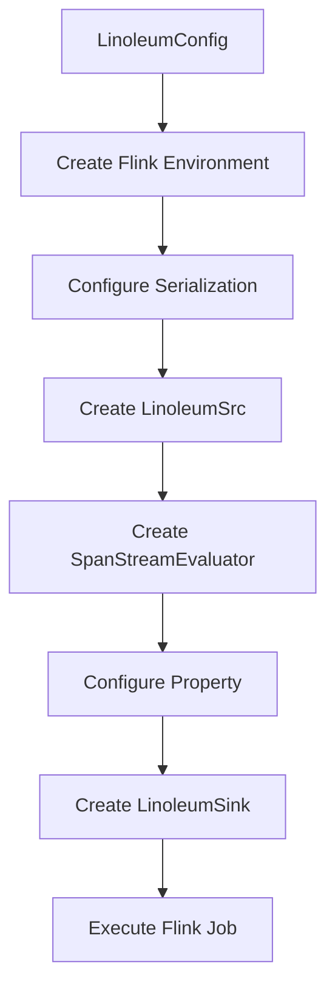

**Job Configuration**:
- **Local vs Cluster**: `localFlinkEnv` flag controls execution mode
- **Serialization**: Kryo with protobuf support for OTEL messages
- **Web UI**: Local mode provides Flink web UI at `localhost:8081`

**Execution Steps**:
1. **Environment Setup**: Configure Flink execution environment
2. **Source Creation**: Set up Kafka source with watermark strategy
3. **Processing Pipeline**: Apply keyBy, windows, and evaluation
4. **Sink Configuration**: Set up MongoDB sink with batching
5. **Job Execution**: Execute Flink job with specified name

## Error Handling and Recovery Workflows

### 8. Error Recovery Strategies
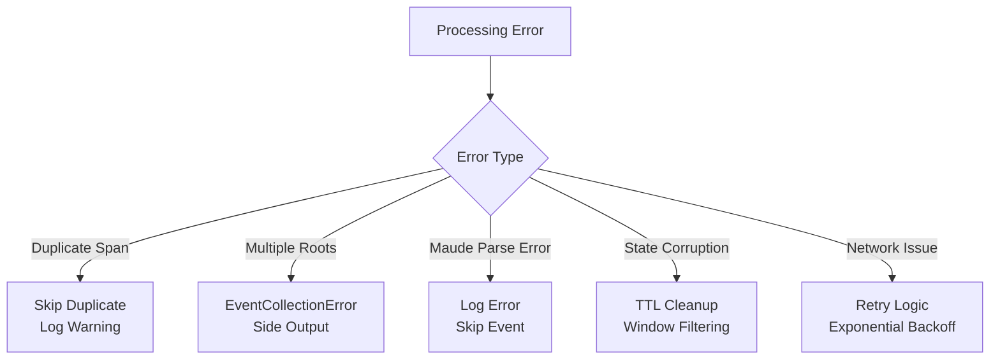

**Error Types and Handling**:
- **Duplicate Spans**: Skip with warning log
- **Multiple Root Spans**: `EventCollectionMultipleRootSpansError` to side output
- **Maude Runtime Errors**: Log errors, skip problematic events
- **State TTL Issues**: Custom `shouldIgnoreWindow` function
- **Network Failures**: MongoDB sink retry with exponential backoff

### 9. State Management Workflow
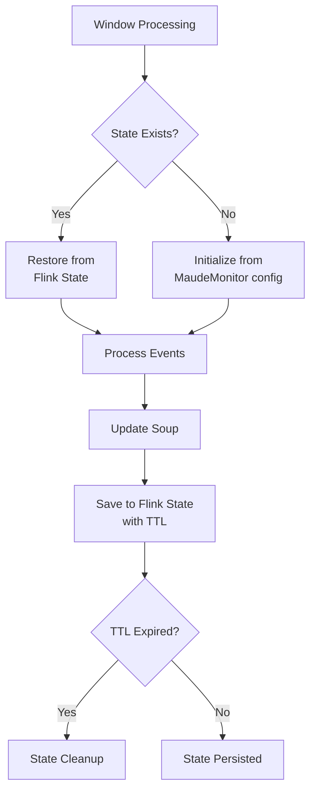

**State Lifecycle**:
1. **Initialization**: First window for a key initializes state from `initialSoup`
2. **Restoration**: Subsequent windows restore state from Flink keyed state
3. **Update**: Events update soup state through Maude rewriting
4. **Persistence**: Updated state saved back to Flink
5. **Cleanup**: TTL-based automatic state expiration

## Monitoring and Debugging Workflows

### 10. Debug Logging Workflow
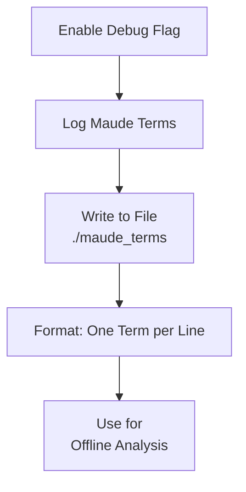

**Debug Features**:
- `logMaudeTerms`: Write all processed spans as Maude terms to file
- **Log Levels**: Configurable logging for different components
- **Metrics**: Flink metrics integration for monitoring
- **Side Outputs**: Error streams for problematic traces

### 11. Performance Monitoring
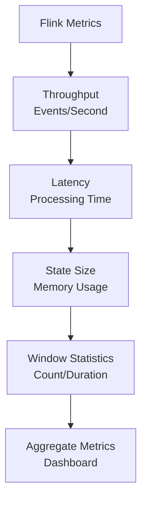

**Monitoring Points**:
- **Source Metrics**: Kafka consumption rates
- **Processing Metrics**: Event processing throughput
- **State Metrics**: Maude soup size and growth
- **Sink Metrics**: MongoDB write performance
- **Window Metrics**: Session window statistics

## Extension Workflows

### 12. Adding New Property Types
```mermaid
flowchart TD
    A[Define Property Type] --> B[Implement Property[P] trait]
    B --> C[Add to PropertyInstances]
    C --> D[Create Factory Methods]
    D --> E[Update Configuration]
    E --> F[Test Integration]
    F --> G[Deploy]
```

**Extension Steps**:
1. **Type Definition**: Define property configuration class
2. **Trait Implementation**: Implement `Property[P]` type class
3. **Instance Registration**: Add to `PropertyInstances` companion object
4. **Factory Methods**: Add to `Linoleum` object for easy usage
5. **Configuration**: Update config classes if needed
6. **Testing**: Unit and integration tests
7. **Deployment**: Package and deploy

### 13. Custom Key Grouping
```scala
case class CustomKeyBy(attribute: String) extends KeyByCriteria {
  override def keyBy(span: SpanInfo): String = {
    span.getSpan.getAttributesList.asScala
      .find(_.getKey == attribute)
      .map(kv => anyValueToMaude(kv.getValue))
      .getOrElse(span.hexTraceId)
  }
}
```

**Customization Points**:
- **KeyByCriteria**: Implement custom grouping logic
- **Maude Hooks**: Add equality/rewriting hooks for Maude integration
- **Window Filters**: Custom logic for ignoring windows
- **Serialization**: Custom serializers for new data types

## Example Usage Workflows

### 14. LTLss Formula Example
```scala
val formula = LinoleumFormula(
  name = "ResponseTimeUnder1s",
  config = LinoleumFormula.EvaluationConfig(
    tickPeriod = Duration.ofSeconds(1),
    sessionGap = Duration.ofMinutes(5),
    allowedLateness = Duration.ofSeconds(30)
  ),
  formula = linoleumFormula {
    always { letter: Letter =>
      letter.findMatchingSpan {
        case SpanStart(span) if span.isNamed("http.request") => span
      }.forall { span =>
        val duration = span.getSpan.getEndTimeUnixNano - 
                      span.getSpan.getStartTimeUnixNano
        duration <= 1_000_000_000L  // 1 second in nanoseconds
      }
    } during 60  // Evaluate for 60 time units
  }
)

val config = LinoleumConfig(
  jobName = "response-time-monitor",
  localFlinkEnv = true,
  source = SourceConfig(kafkaTopics = "http-traces"),
  sink = SinkConfig()
)

Linoleum.execute(config, formula)
```

### 15. Maude Monitor Example
```scala
val monitor = MaudeMonitor(
  name = "ImageGenSafety",
  program = "maude/lotrbot_imagegen_safety.maude",
  module = "IMAGE-GEN-SAFETY",
  monitorOid = "'monitor",
  initialSoup = "< 'monitor : Monitor | state: idle >",
  property = "safe",
  keyBy = KeyByStringSpanAttribute("agent.name"),
  dependencyPrograms = List("maude/linoleum/trace.maude"),
  dependencyStdlibPrograms = List("model-checker.maude"),
  stateConfig = Some(MaudeMonitor.StateConfig(
    ttl = Duration.ofHours(24),
    shouldIgnoreWindow = (key, events) => 
      events.isEmpty || events.head.span.getSpan.getName.contains("test")
  )),
  config = MaudeMonitor.EvaluationConfig(
    messageRewriteBound = 100,
    sessionGap = Duration.ofMinutes(10),
    allowedLateness = Duration.ofSeconds(60)
  )
)

val config = LinoleumConfig(
  jobName = "image-gen-safety",
  localFlinkEnv = false,
  source = SourceConfig(kafkaTopics = "image-gen-traces"),
  sink = SinkConfig(logMaudeTerms = true)
)

Linoleum.execute(config, monitor)